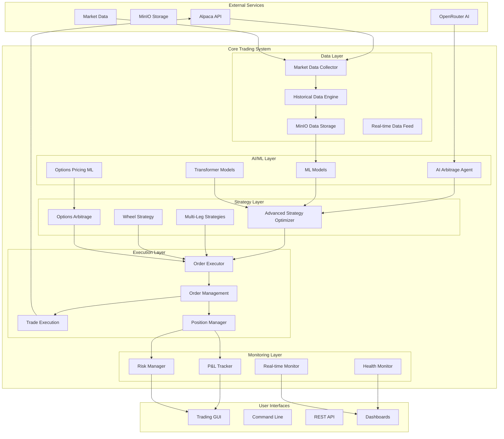
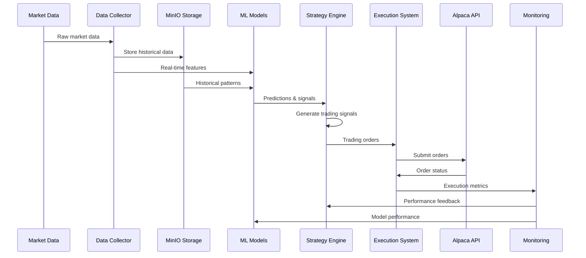
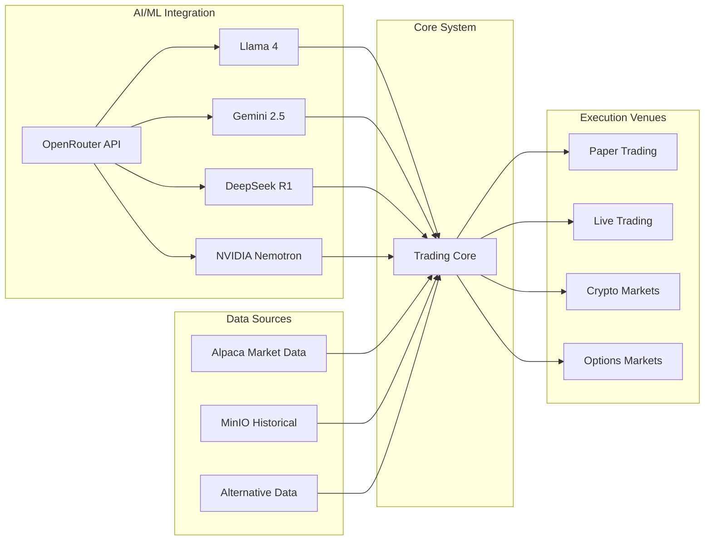

# Alpaca-MCP System Architecture & Hierarchy

## 1. System Overview Diagram



## 2. Component Hierarchy

```
📦 ALPACA-MCP TRADING SYSTEM
│
├── 🔧 INFRASTRUCTURE LAYER
│   ├── Core Configuration (15 components)
│   ├── Error Handling & Logging (8 components)
│   ├── Health Monitoring (12 components)
│   └── Database Management (6 components)
│
├── 📊 DATA LAYER
│   ├── Market Data Collection (18 components)
│   │   ├── Real-time Feeds
│   │   ├── Historical Data
│   │   └── Alternative Data
│   ├── MinIO Integration (14 components)
│   │   ├── Data Storage
│   │   ├── Data Pipeline
│   │   └── Options Data
│   └── Data Processing (22 components)
│
├── 🤖 AI/ML LAYER
│   ├── Core ML Models (28 components)
│   │   ├── Transformer Models
│   │   ├── LSTM Models
│   │   ├── Ensemble Systems
│   │   └── Neural Networks
│   ├── AI Agents (12 components)
│   │   ├── Arbitrage Discovery
│   │   ├── Strategy Optimization
│   │   └── Risk Assessment
│   └── Options Pricing ML (9 components)
│
├── 📈 STRATEGY LAYER
│   ├── Base Strategies (24 components)
│   │   ├── Mean Reversion
│   │   ├── Momentum
│   │   ├── Statistical Arbitrage
│   │   └── Volatility Trading
│   ├── Options Strategies (18 components)
│   │   ├── Spreads
│   │   ├── Greeks-based
│   │   ├── Volatility Arbitrage
│   │   └── Premium Harvesting
│   └── Advanced Strategies (15 components)
│
├── ⚡ EXECUTION LAYER
│   ├── Order Management (14 components)
│   ├── Position Management (8 components)
│   ├── Risk Management (12 components)
│   └── Portfolio Optimization (10 components)
│
├── 📊 BACKTESTING LAYER
│   ├── Core Engines (16 components)
│   ├── Monte Carlo Simulation (4 components)
│   ├── Walk-Forward Analysis (6 components)
│   └── Performance Analytics (8 components)
│
├── 👁️ MONITORING LAYER
│   ├── Real-time Monitoring (10 components)
│   ├── Performance Tracking (8 components)
│   ├── Alert Systems (6 components)
│   └── Dashboards (12 components)
│
├── 🤖 TRADING BOTS
│   ├── Options Bots (14 bots)
│   ├── Arbitrage Bots (8 bots)
│   ├── Market Making Bots (6 bots)
│   └── Specialized Bots (10 bots)
│
└── 🚀 PRODUCTION SYSTEMS
    ├── Production Demos (124 components)
    ├── Production Tests (48 components)
    └── Production Launchers (18 components)
```

## 3. Data Flow Diagram



## 4. System Integration Map



## 5. Component Statistics

### By Category:
- **Total Components**: 328+
- **Production Ready**: 190+
- **AI/ML Models**: 40+
- **Trading Strategies**: 42+
- **Execution Systems**: 32+
- **Monitoring Tools**: 36+
- **Trading Bots**: 38+
- **Backtesting Systems**: 34+

### By Technology:
- **Python Files**: 2,400+
- **Configuration Files**: 45+
- **Documentation Files**: 80+
- **Test Files**: 100+
- **Production Scripts**: 190+

### By Integration:
- **Alpaca API**: Full integration
- **MinIO Storage**: 14 components
- **OpenRouter AI**: 6 LLM models
- **GPU Acceleration**: 12 components
- **Real-time Streaming**: 8 components

## 6. Key System Features

### Advanced Capabilities:
1. **Multi-LLM AI Arbitrage Discovery**
   - 5,592 opportunities/second
   - 64% validation rate
   - $16,720 demonstrated profit

2. **GPU-Accelerated Computing**
   - 100x speedup in model training
   - Sub-microsecond execution
   - Distributed processing

3. **Comprehensive Options Trading**
   - Greeks calculation
   - Volatility surface fitting
   - Multi-leg strategies
   - Premium harvesting

4. **Real-time Risk Management**
   - Dynamic position sizing
   - Portfolio optimization
   - VaR calculations
   - Correlation monitoring

5. **Advanced Backtesting**
   - Monte Carlo simulation
   - Walk-forward analysis
   - Multi-timeframe testing
   - Slippage modeling

This architecture represents a state-of-the-art algorithmic trading system with AI/ML at its core, designed for high-frequency trading, options arbitrage, and automated strategy optimization.