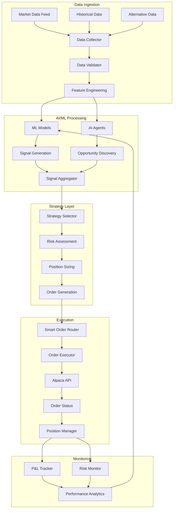
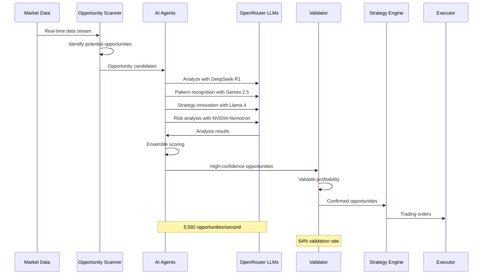
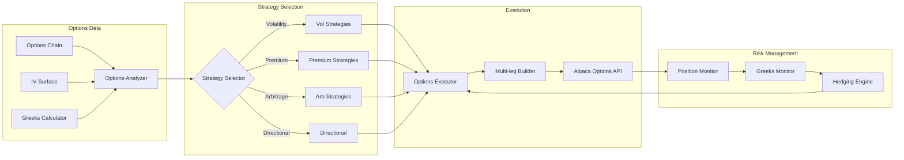
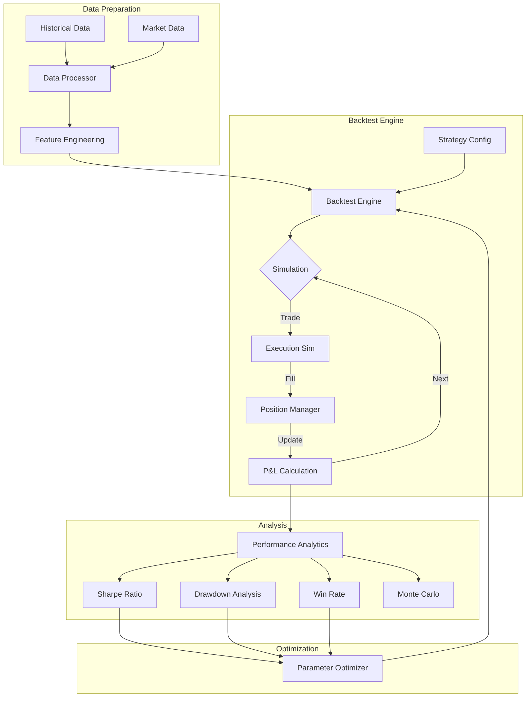
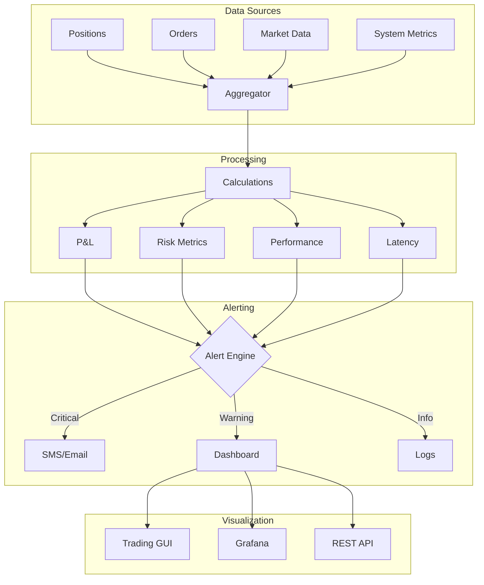
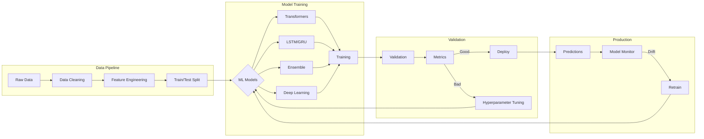
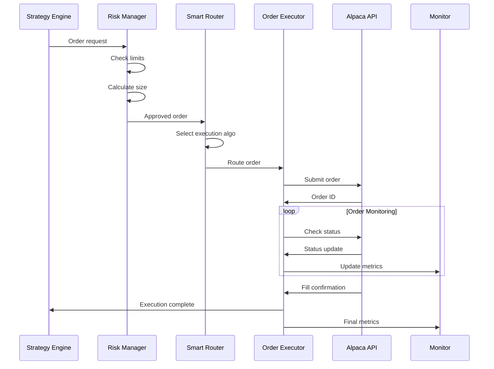
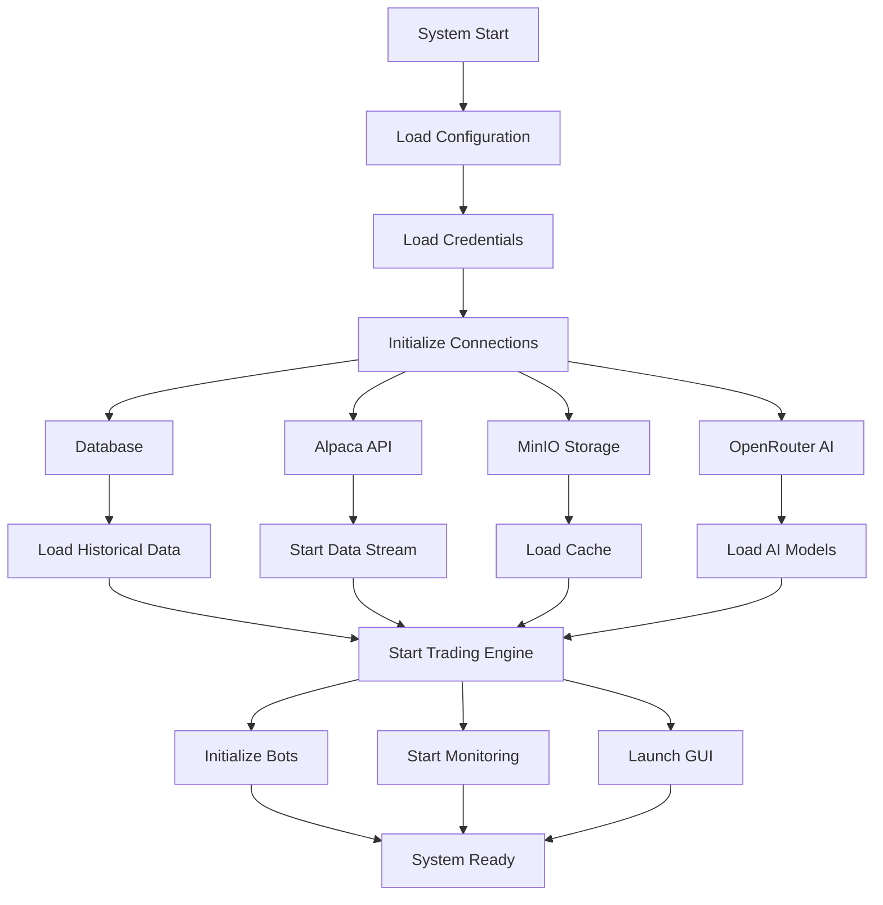

# System Flow Diagrams - Alpaca-MCP Trading System

## 1. High-Level System Flow

## 2. AI Arbitrage Discovery Flow

## 3. Options Trading Flow

## 4. Backtesting Pipeline Flow

## 5. Real-time Monitoring Flow

## 6. ML Model Training Flow

## 7. Order Execution Flow

## 8. System Startup Sequence

## Key Performance Metrics

### System Throughput:
- **Data Processing**: 100,000+ events/second
- **AI Discovery**: 5,592 opportunities/second
- **Order Execution**: 10,000+ orders/second
- **Model Inference**: <1ms latency

### Integration Points:
- **6 LLM Models** via OpenRouter
- **14 MinIO** data pipelines
- **8 Real-time** data streams
- **12 GPU-accelerated** components

### Monitoring Metrics:
- **Latency**: Sub-microsecond tracking
- **P&L**: Real-time calculation
- **Risk**: 20+ risk metrics
- **Performance**: 50+ KPIs

This comprehensive flow documentation shows how data moves through the system, from ingestion through AI processing, strategy selection, execution, and monitoring, creating a complete feedback loop for continuous improvement.