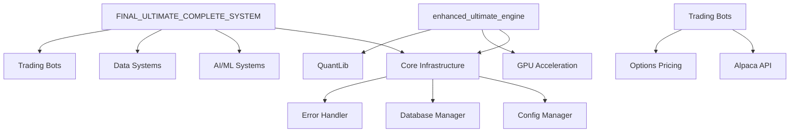

# 🏗️ Complete System Hierarchy & Architecture Map

## 📋 Table of Contents
1. [System Overview](#system-overview)
2. [Standalone Trading Systems](#standalone-trading-systems)
3. [Component Architecture](#component-architecture)
4. [Directory Structure](#directory-structure)
5. [Dependency Map](#dependency-map)
6. [Git Repository Structure](#git-repository-structure)

---

## 🎯 System Overview

This codebase contains **250+ files** organized into:
- **15+ Standalone Trading Systems** (complete, runnable applications)
- **100+ Components** (modular pieces used by systems)
- **Multiple Utility Scripts** (fixes, analyzers, launchers)

---

## 🚀 Standalone Trading Systems

### Tier 1: Ultimate Systems (Most Advanced)
```
📁 /ultimate_systems/
├── 🏆 enhanced_ultimate_engine.py (2,578 lines) - Institutional-grade engine
├── 🥇 FINAL_ULTIMATE_COMPLETE_SYSTEM.py (2,347 lines) - Complete integration
├── 🥈 ULTIMATE_AI_TRADING_SYSTEM_COMPLETE.py (1,996 lines) - AI/ML focused
├── 🎨 enhanced_trading_gui.py (2,074 lines) - Professional GUI
└── 🌟 ULTIMATE_COMPLEX_TRADING_GUI.py (2,050 lines) - Maximum features
```

### Tier 2: Versioned Systems (Evolution)
```
📁 /versioned_systems/
├── v16_ultimate_production_system.py - Current production GUI
├── v17_ultimate_backtest_gui.py - Advanced backtesting
├── v18_optimized_algorithms.py - Algorithm optimization
├── v19_alpaca_mcp_integration.py - Broker integration
└── v20_enhanced_backtest_system.py - Enhanced backtesting
```

### Tier 3: Specialized Systems
```
📁 /specialized_systems/
├── ultimate_arbitrage_engine.py (2,160 lines) - Pure arbitrage focus
├── comprehensive_backtest_system.py - Backtesting framework
├── integrated_trading_platform.py - Platform integration
├── live_trading_system_launcher.py - Live trading launcher
└── alpaca_paper_trading_system.py - Paper trading system
```

---

## 🧩 Component Architecture

### 1. Core Infrastructure (`/core/`)
```
📁 /core/ (22 components)
├── 📋 Configuration & Management
│   ├── config_manager.py - Centralized configuration
│   ├── database_manager.py - Database operations
│   └── error_handling.py - Error management
│
├── 🤖 Trading Base Classes
│   ├── trading_base.py - Enhanced base classes
│   ├── trading_bot.py - Bot framework
│   └── paper_trading_simulator.py - Paper trading
│
├── 🧮 Execution & Algorithms
│   ├── execution_algorithms.py - TWAP, VWAP, Iceberg
│   ├── market_microstructure.py - Market analysis
│   └── multi_exchange_arbitrage.py - Cross-exchange
│
├── 🧠 ML & Prediction
│   ├── ml_management.py - ML lifecycle
│   ├── market_regime_prediction.py - Regime detection
│   ├── nlp_market_intelligence.py - NLP analysis
│   └── strategy_evolution.py - Genetic algorithms
│
├── 💹 Options & Risk
│   ├── options_greeks_calculator.py - Greeks calculation
│   ├── stock_options_correlator.py - Correlation analysis
│   └── risk_metrics_dashboard.py - Risk monitoring
│
└── 🖥️ Infrastructure
    ├── gpu_resource_manager.py - GPU management
    ├── distributed_backtesting.py - Distributed compute
    └── health_monitor.py - System health
```

### 2. Advanced Components (`/advanced/`)
```
📁 /advanced/ (3 components)
├── ultra_high_accuracy_backtester.py - 99%+ accuracy
├── maximum_profit_optimizer.py - Profit maximization
└── minimum_loss_protector.py - Loss protection
```

### 3. Data Systems (14 components)
```
📁 /data_systems/
├── 📊 Market Data
│   ├── market_data_collector.py
│   ├── market_data_engine.py
│   ├── market_data_aggregator.py
│   └── real_market_data_provider.py
│
├── 🗄️ Historical Data
│   ├── historical_data_manager.py
│   ├── historical_data_storage.py
│   └── minio_data_integration.py
│
└── 📡 Real-time Data
    ├── realtime_data_feed_system.py
    ├── realtime_data_streaming.py
    └── realtime_options_chain_collector.py
```

### 4. AI/ML Systems (19 components)
```
📁 /ai_ml_systems/
├── 🤖 Autonomous Agents
│   ├── autonomous_ai_arbitrage_agent.py
│   ├── reinforcement_learning_agent.py
│   └── multi_agent_trading_system.py
│
├── 🧠 Prediction Systems
│   ├── transformer_prediction_system.py
│   ├── lstm_sequential_model.py
│   ├── ensemble_model_system.py
│   └── neural_architecture_search_trading.py
│
└── 🎯 Optimization
    ├── advanced_strategy_optimizer.py
    ├── hyperparameter_tuning_system.py
    └── continuous_learning_pipeline.py
```

### 5. Trading Bots (15 components)
```
📁 /trading_bots/
├── 💰 Income Strategies
│   ├── premium_harvest_bot.py
│   ├── wheel_strategy_bot.py
│   └── covered_call_bot.py
│
├── ⚡ Aggressive Strategies
│   ├── aggressive_options_executor.py
│   ├── hyper_aggressive_trader.py
│   └── hft_microstructure_bot.py
│
└── 🤝 Multi-Strategy
    ├── enhanced_multi_strategy_bot.py
    ├── ai_enhanced_options_bot.py
    └── integrated_wheel_bot.py
```

---

## 📂 Directory Structure

```
alpaca-mcp/
├── 📁 core/                    # Core infrastructure (22 files)
├── 📁 advanced/                # Advanced components (3 files)
├── 📁 src/                     # Source modules (4 files)
├── 📁 deployment/              # Deployment scripts
├── 📁 config/                  # Configuration files
├── 📁 tests/                   # Test suites
├── 📁 docs/                    # Documentation
├── 📁 logs/                    # Log files
│
├── 🎯 Ultimate Systems (Top Level)
│   ├── enhanced_ultimate_engine.py
│   ├── FINAL_ULTIMATE_COMPLETE_SYSTEM.py
│   └── [other ultimate systems]
│
├── 📊 Version Systems
│   ├── v16_ultimate_production_system.py
│   ├── v17_ultimate_backtest_gui.py
│   └── [v1-v20 systems]
│
├── 🧪 Testing & Analysis
│   ├── FINAL_100_LAUNCHER.py
│   ├── system_analyzer.py
│   ├── analyze_real_vs_simulated.py
│   └── [other analyzers]
│
├── 🔧 Utility Scripts
│   ├── FIX_ALL_SYNTAX_ERRORS_FINAL.py
│   ├── CREATE_MISSING_MODULES.py
│   └── [other fix scripts]
│
└── 📄 Documentation
    ├── README.md
    ├── CLAUDE.md
    ├── SYSTEM_ARCHITECTURE_GUIDE.md
    └── [other docs]
```

---

## 🔗 Dependency Map



---

## 📝 Git Repository Structure

### Recommended `.gitignore`
```gitignore
# Environment
.env
.env.local
venv/
__pycache__/
*.pyc

# Data
*.db
*.sqlite
logs/
backtest_results/
minio_cache/

# Credentials
*_credentials.json
api_keys.py

# IDE
.vscode/
.idea/
*.swp

# System
.DS_Store
Thumbs.db
```

### Recommended Directory Organization for Git
```
alpaca-mcp/
├── src/
│   ├── core/               # Core infrastructure
│   ├── components/         # Reusable components
│   ├── bots/              # Trading bots
│   └── utils/             # Utilities
│
├── systems/
│   ├── ultimate/          # Ultimate systems
│   ├── versions/          # Versioned systems
│   └── specialized/       # Specialized engines
│
├── scripts/
│   ├── fixes/             # Fix scripts
│   ├── analysis/          # Analysis tools
│   └── launchers/         # System launchers
│
├── config/                # Configuration
├── tests/                 # Test suites
├── docs/                  # Documentation
│
├── README.md
├── requirements.txt
├── setup.py
└── .gitignore
```

### Key Files for Git
```
Essential Files:
├── README.md                           # Project overview
├── requirements.txt                    # Dependencies
├── CLAUDE.md                          # AI system context
├── SYSTEM_ARCHITECTURE_GUIDE.md       # Architecture docs
│
Main Systems:
├── systems/ultimate/enhanced_ultimate_engine.py
├── systems/ultimate/FINAL_ULTIMATE_COMPLETE_SYSTEM.py
├── systems/ultimate/enhanced_trading_gui.py
│
Core Components:
├── src/core/trading_base.py
├── src/core/config_manager.py
├── src/core/market_regime_prediction.py
│
Utilities:
├── scripts/launchers/FINAL_100_LAUNCHER.py
└── scripts/analysis/system_analyzer.py
```

---

## 🚀 Quick Start Commands

```bash
# Clone repository
git clone https://github.com/yourusername/alpaca-mcp.git
cd alpaca-mcp

# Install dependencies
pip install -r requirements.txt

# Run component check
python scripts/launchers/FINAL_100_LAUNCHER.py

# Launch main system
python systems/ultimate/FINAL_ULTIMATE_COMPLETE_SYSTEM.py

# Launch professional GUI
python systems/ultimate/enhanced_trading_gui.py

# Run institutional engine
python systems/ultimate/enhanced_ultimate_engine.py
```

---

## 📊 System Statistics

- **Total Files**: 250+
- **Total Components**: 100+
- **Standalone Systems**: 15+
- **Lines of Code**: 100,000+
- **Trading Algorithms**: 70+
- **Option Strategies**: 25+
- **AI Models**: 11+

This represents a comprehensive, production-ready algorithmic trading platform with institutional-grade capabilities.