# Alpaca-MCP Trading System Architecture

## Table of Contents
1. [System Overview](#system-overview)
2. [High-Level Architecture](#high-level-architecture)
3. [Component Architecture](#component-architecture)
4. [Data Flow Architecture](#data-flow-architecture)
5. [Deployment Architecture](#deployment-architecture)
6. [Security Architecture](#security-architecture)
7. [Performance Architecture](#performance-architecture)
8. [Monitoring Architecture](#monitoring-architecture)

## System Overview

The Alpaca-MCP Trading System is an institutional-grade algorithmic trading platform that combines traditional quantitative strategies with cutting-edge AI/ML technologies. The system operates at the intersection of high-frequency trading, options arbitrage, and advanced machine learning.

### Key Capabilities
- **10,000+ opportunities/second** discovery rate
- **Sub-microsecond** execution latency
- **22+ years** of historical data integration
- **36+ option spread strategies**
- **5 cutting-edge algorithms** (Quantum, Swarm, NAS, Meta-RL, Adversarial)
- **134 ML features** with comprehensive edge case handling

## High-Level Architecture

```mermaid
graph TB
    subgraph "Data Sources"
        A1[Alpaca API<br/>Live/Paper Trading]
        A2[MinIO Server<br/>22+ Years Historical]
        A3[Market Data Feeds<br/>Real-time Streams]
        A4[Options Data<br/>Greeks & Chains]
    end
    
    subgraph "Core Trading Engine"
        B1[Master Trading Orchestrator]
        B2[Order Management System]
        B3[Risk Management Engine]
        B4[Portfolio Manager]
        B5[Execution Engine]
    end
    
    subgraph "AI/ML Layer"
        C1[Production ML System<br/>134 Features]
        C2[Quantum Trading<br/>Superposition Analysis]
        C3[Swarm Intelligence<br/>100+ Agents]
        C4[Neural Architecture Search<br/>Self-Evolving]
        C5[Meta-RL<br/>Fast Adaptation]
        C6[Adversarial Prediction<br/>GAN-Based]
    end
    
    subgraph "Strategy Layer"
        D1[Options Executor<br/>36+ Strategies]
        D2[HFT Arbitrage<br/>Multi-Exchange]
        D3[Statistical Arbitrage]
        D4[Market Making]
        D5[Volatility Trading]
    end
    
    subgraph "Infrastructure"
        E1[GPU Cluster<br/>4+ NVIDIA GPUs]
        E2[Redis Cache<br/>In-Memory Data]
        E3[PostgreSQL<br/>Trade History]
        E4[MongoDB<br/>Market Data]
        E5[Kafka<br/>Event Streaming]
    end
    
    subgraph "User Interface"
        F1[Ultra Enhanced GUI<br/>11 Tabs]
        F2[REST API<br/>External Access]
        F3[WebSocket API<br/>Real-time Updates]
        F4[CLI Tools<br/>Admin Access]
    end
    
    A1 --> B1
    A2 --> B1
    A3 --> B1
    A4 --> B1
    
    B1 --> B2
    B1 --> B3
    B1 --> B4
    B1 --> B5
    
    B1 <--> C1
    B1 <--> C2
    B1 <--> C3
    B1 <--> C4
    B1 <--> C5
    B1 <--> C6
    
    B2 --> D1
    B2 --> D2
    B2 --> D3
    B2 --> D4
    B2 --> D5
    
    B1 <--> E1
    B1 <--> E2
    B1 <--> E3
    B1 <--> E4
    B1 <--> E5
    
    B1 --> F1
    B1 --> F2
    B1 --> F3
    B1 --> F4
```



## Component Architecture

### 1. Data Layer Components

#### Market Data Manager
- **Purpose**: Centralized management of all market data sources
- **Components**:
  - Real-time feed handlers
  - Historical data loaders
  - Data normalization engine
  - Symbol universe manager
- **Interfaces**:
  - Alpaca WebSocket/REST APIs
  - MinIO S3-compatible API
  - Custom data feed protocols

#### MinIO Historical Data System
- **Storage**: 22+ years (2002-2024) of market data
- **Format**: Parquet files with compression
- **Organization**: 
  ```
  /market-data/
    ├── equities/
    │   ├── daily/
    │   ├── intraday/
    │   └── tick/
    ├── options/
    │   ├── chains/
    │   ├── greeks/
    │   └── implied_vol/
    └── indices/
  ```

### 2. Trading Engine Components

#### Master Trading Orchestrator
- **Central Command**: Coordinates all trading activities
- **Responsibilities**:
  - Strategy scheduling and execution
  - Resource allocation
  - Performance tracking
  - System health monitoring
- **Key Methods**:
  ```python
  async def execute_trading_cycle()
  async def allocate_capital()
  async def monitor_positions()
  async def handle_market_events()
  ```

#### Order Management System (OMS)
- **Functions**:
  - Order lifecycle management
  - Smart order routing
  - Execution algorithms
  - Fill tracking and reconciliation
- **Order Types Supported**:
  - Market, Limit, Stop, Stop-Limit
  - Iceberg, TWAP, VWAP
  - Custom option spreads
  - Basket orders

#### Risk Management Engine
- **Real-time Risk Metrics**:
  - Position limits
  - VaR calculations
  - Stress testing
  - Correlation monitoring
  - Greek exposures
- **Risk Controls**:
  - Pre-trade validation
  - Position size limits
  - Loss thresholds
  - Circuit breakers

### 3. AI/ML Components

#### Production ML Training System
- **Features**: 134 engineered features
- **Models**:
  - Random Forest (primary)
  - XGBoost (if available)
  - LightGBM
  - Deep Learning (LSTM, Transformer)
  - SVM for classification
- **Training Pipeline**:
  ```
  Data → Feature Engineering → Model Training → Validation → Deployment
  ```

#### Quantum-Inspired Trading
- **Quantum Concepts Applied**:
  - Superposition for multi-state analysis
  - Entanglement for correlation detection
  - Tunneling for resistance breakthrough
  - Wave function collapse for price prediction
- **Implementation**: NumPy-based quantum simulators

#### Swarm Intelligence System
- **Architecture**:
  - 100+ autonomous agents
  - 6 strategy types per swarm
  - Small-world network topology
  - Pheromone-based communication
- **Emergent Behaviors**:
  - Pattern detection
  - Consensus formation
  - Strategy evolution

### 4. Strategy Components

#### Comprehensive Options Executor
- **36+ Strategies Including**:
  - Iron Condor, Butterfly, Calendar
  - Straddle, Strangle, Collar
  - Ratio spreads, Diagonal spreads
  - Custom multi-leg strategies
- **Execution Logic**:
  ```python
  def build_spread() → validate() → optimize_legs() → execute()
  ```

#### High-Frequency Trading Engine
- **Capabilities**:
  - Microsecond latency
  - Co-location ready
  - Market microstructure analysis
  - Order book reconstruction
- **Strategies**:
  - Statistical arbitrage
  - Latency arbitrage
  - Market making
  - Momentum ignition

### 5. Infrastructure Components

#### GPU Cluster Architecture
- **Configuration**:
  - 4+ NVIDIA GPUs (A100/H100 recommended)
  - CUDA 12.0+ support
  - NVLink for inter-GPU communication
  - Distributed training framework
- **Workload Distribution**:
  - ML model training
  - Real-time inference
  - Quantum simulations
  - Neural architecture search

#### Data Storage Architecture
- **PostgreSQL**: Trade history, positions, accounts
- **MongoDB**: Market data, tick storage
- **Redis**: Real-time cache, session data
- **MinIO**: Historical data archive
- **SQLite**: Local paper trading

#### Message Queue Architecture
- **Kafka Streams**:
  - Market data topics
  - Trade execution topics
  - Risk alert topics
  - System event topics
- **Event Sourcing**: Complete audit trail

## Data Flow Architecture

### Real-Time Data Flow
```
Market Data → WebSocket → Data Manager → Strategy Engine → Signal Generation
                                      ↓
                                 Risk Check
                                      ↓
                              Order Management → Execution → Position Update
```

### ML Pipeline Data Flow
```
Historical Data → Feature Engineering → Model Training → Model Registry
                                                              ↓
Live Data → Feature Extraction → Model Inference → Trading Signals
```

### Order Execution Flow
```
Signal → Pre-Trade Risk → Order Creation → Smart Routing → Exchange
                                                              ↓
                                                         Execution
                                                              ↓
Position Update ← Post-Trade Allocation ← Fill Confirmation
```

## Deployment Architecture

### Production Deployment
```yaml
version: '3.8'
services:
  trading-engine:
    replicas: 3
    resources:
      limits:
        cpus: '8'
        memory: 64G
        nvidia.com/gpu: 1
    
  ml-workers:
    replicas: 4
    resources:
      limits:
        cpus: '16'
        memory: 128G
        nvidia.com/gpu: 2
    
  data-services:
    replicas: 2
    resources:
      limits:
        cpus: '4'
        memory: 32G
```

### High Availability Setup
- **Active-Active**: Multiple trading engines
- **Failover**: Automatic leader election
- **State Replication**: Redis Sentinel
- **Data Redundancy**: MinIO erasure coding

## Security Architecture

### Authentication & Authorization
- **API Keys**: Encrypted storage
- **JWT Tokens**: Session management
- **Role-Based Access**: Granular permissions
- **MFA**: Two-factor authentication

### Data Security
- **Encryption at Rest**: AES-256
- **Encryption in Transit**: TLS 1.3
- **Key Management**: HashiCorp Vault
- **Audit Logging**: Immutable logs

### Network Security
- **VPC Isolation**: Private subnets
- **Firewall Rules**: Strict ingress/egress
- **DDoS Protection**: CloudFlare
- **VPN Access**: Site-to-site tunnels

## Performance Architecture

### Latency Optimization
- **Co-location**: Exchange proximity
- **Kernel Bypass**: DPDK networking
- **Memory Pools**: Pre-allocated buffers
- **Lock-Free Structures**: Atomic operations

### Throughput Optimization
- **Parallel Processing**: Multi-core utilization
- **Batch Operations**: Vectorized computations
- **Caching Strategy**: Multi-level caches
- **Compression**: Wire protocol optimization

### Scalability Design
- **Horizontal Scaling**: Microservices architecture
- **Load Balancing**: Intelligent routing
- **Auto-Scaling**: Demand-based provisioning
- **Resource Pooling**: Shared infrastructure

## Monitoring Architecture

### Metrics Collection
- **Prometheus**: Time-series metrics
- **StatsD**: Application metrics
- **OpenTelemetry**: Distributed tracing
- **Custom Metrics**: Trading-specific KPIs

### Visualization & Alerting
- **Grafana Dashboards**:
  - System performance
  - Trading metrics
  - Risk indicators
  - ML model performance
- **AlertManager**: Multi-channel notifications
- **PagerDuty**: On-call rotation

### Logging Architecture
- **ELK Stack**: Elasticsearch, Logstash, Kibana
- **Structured Logging**: JSON format
- **Log Aggregation**: Centralized storage
- **Log Analysis**: Pattern detection

## System Integration Points

### External APIs
- **Alpaca Trading API**: Orders, positions, account
- **Market Data Providers**: Real-time feeds
- **Economic Data**: Fed, ECB APIs
- **Cloud Services**: AWS, GCP, Azure

### Internal APIs
- **REST Endpoints**: CRUD operations
- **WebSocket Streams**: Real-time updates
- **gRPC Services**: High-performance RPC
- **GraphQL**: Flexible queries

### Event-Driven Integration
- **Event Types**:
  - Market events
  - Trade events
  - Risk events
  - System events
- **Event Processing**: Stream processing with Kafka Streams

## Disaster Recovery

### Backup Strategy
- **Real-time Replication**: Multi-region
- **Snapshot Backups**: Hourly/Daily
- **Transaction Logs**: Point-in-time recovery
- **Off-site Storage**: Geographic redundancy

### Recovery Procedures
- **RTO**: < 15 minutes
- **RPO**: < 1 minute
- **Automated Failover**: Health checks
- **Manual Override**: Emergency procedures

## Compliance & Regulatory

### Audit Trail
- **Trade Lifecycle**: Complete tracking
- **Decision Logging**: Algorithm decisions
- **Performance Attribution**: P&L tracking
- **Regulatory Reports**: Automated generation

### Risk Controls
- **Position Limits**: Hard/soft limits
- **Margin Requirements**: Real-time calculation
- **Regulatory Capital**: Basel III compliance
- **Market Abuse Detection**: Pattern monitoring

---

This architecture represents a state-of-the-art trading system combining traditional quantitative finance with cutting-edge AI/ML technologies, designed for institutional-grade performance, reliability, and scalability.