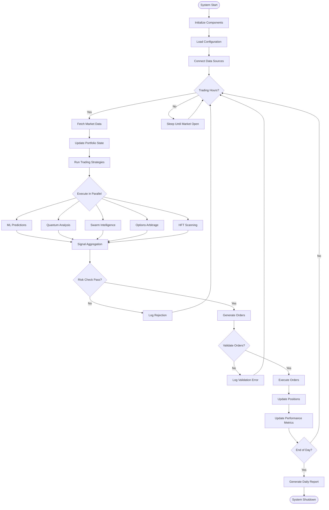
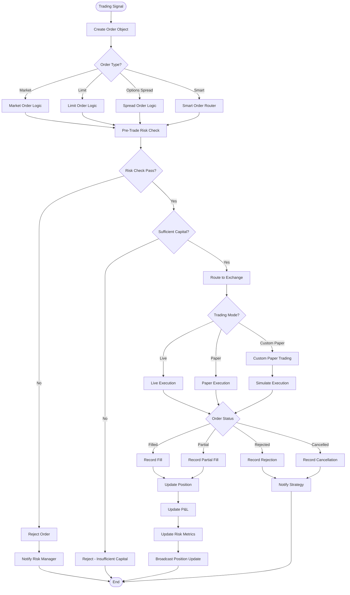
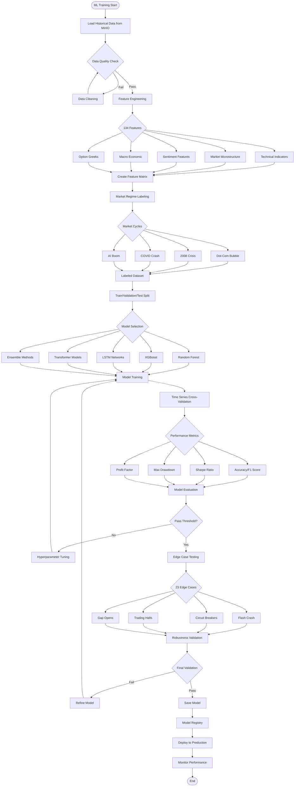
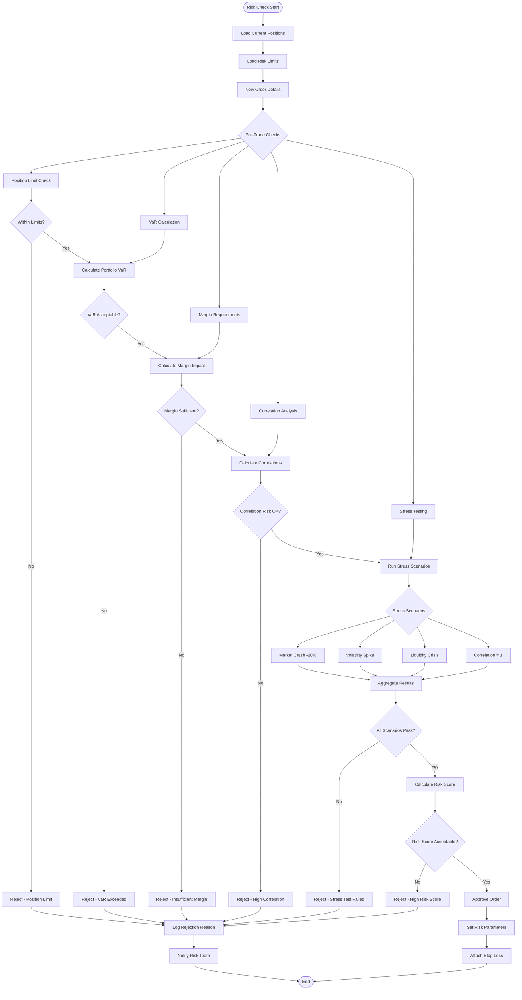
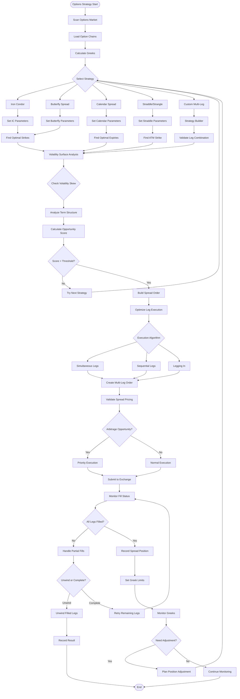
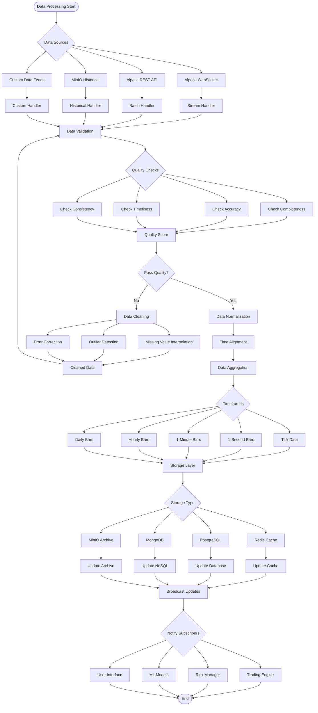
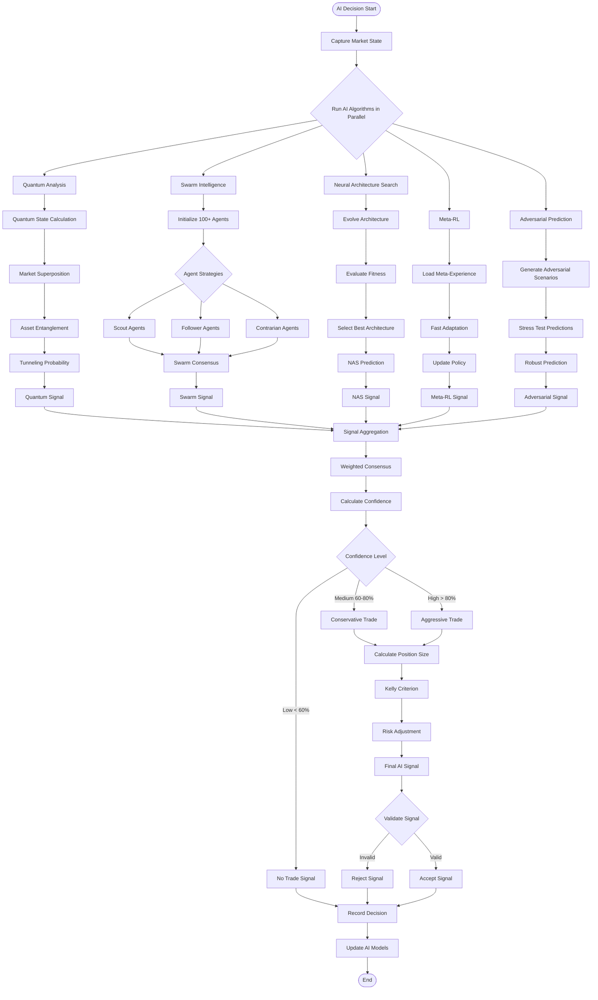
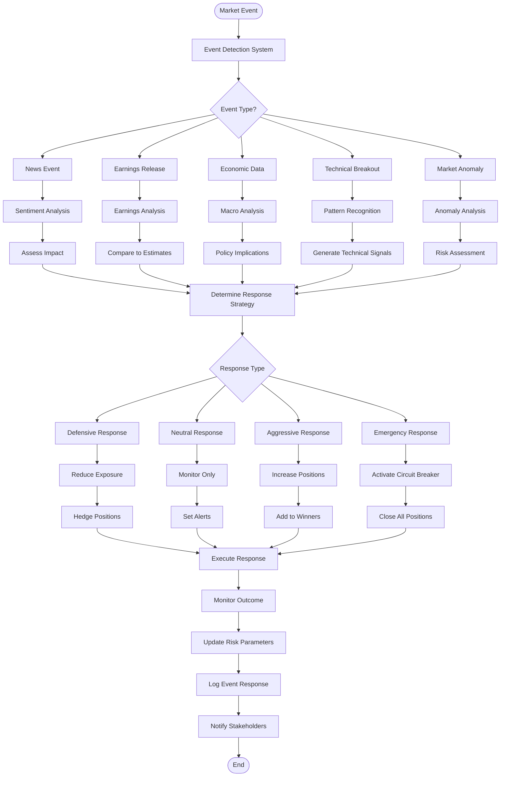
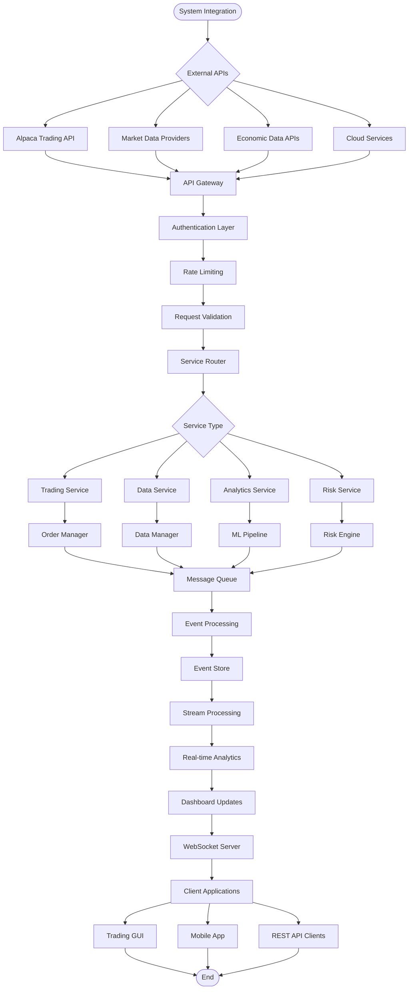

# Alpaca-MCP System Flow Charts

## Table of Contents
1. [Main Trading Flow](#main-trading-flow)
2. [Order Execution Flow](#order-execution-flow)
3. [ML Training Pipeline](#ml-training-pipeline)
4. [Risk Management Flow](#risk-management-flow)
5. [Options Strategy Flow](#options-strategy-flow)
6. [Data Processing Flow](#data-processing-flow)
7. [AI Algorithm Decision Flow](#ai-algorithm-decision-flow)
8. [Market Event Response Flow](#market-event-response-flow)

## Main Trading Flow

## Order Execution Flow

## ML Training Pipeline

## Risk Management Flow

## Options Strategy Flow

## Data Processing Flow

## AI Algorithm Decision Flow

## Market Event Response Flow

## System Integration Flow

---

These flow charts represent the complete operational flows of the Alpaca-MCP trading system, showing how data moves through the system, how decisions are made, and how various components interact to execute trades and manage risk in real-time.